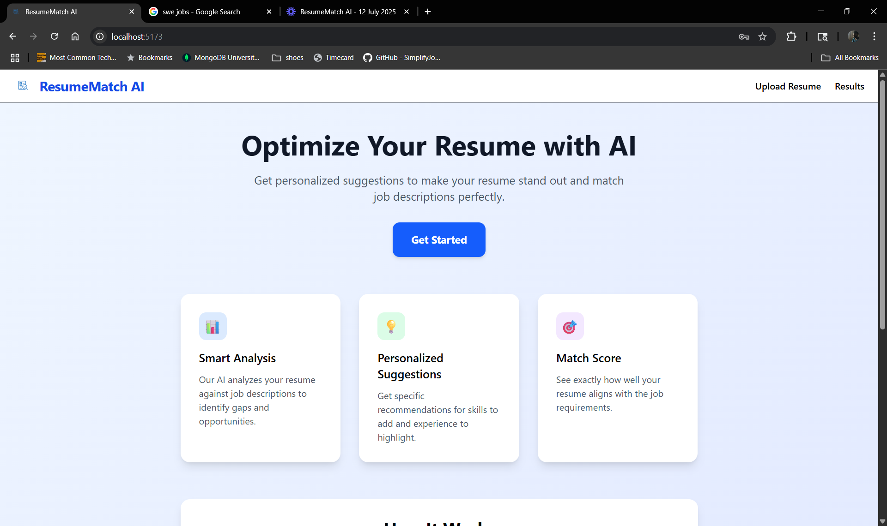

# ResumeMatch AI

**AI-powered resume optimization tool that helps job seekers improve their resumes by comparing them with job descriptions using Google Gemini AI, providing personalized suggestions and match scores.**

---

## Demo

### Home Page


### Login Page


### Upload Resume Page


### Results Page


---

## Overview

ResumeMatch AI is a full-stack application designed to enhance your chances of landing interviews by analyzing how well your resume aligns with specific job descriptions. Leveraging Google's Gemini AI, ResumeMatch AI provides personalized recommendations, match scores, and actionable suggestions to help you stand out in today's competitive job market.

---

## Features

- **AI-Powered Resume Analysis**  
  Get Gemini AI-based suggestions to optimize your resume content for specific job descriptions.

- **Match Score Visualization**  
  See exactly how well your resume aligns with job requirements through an intuitive circular progress indicator.

- **Personalized Suggestions**  
  Receive specific recommendations for skills to add, experience enhancements, and summary improvements.

- **Modern, Minimal UI**  
  Clean, responsive design with intuitive navigation and user-friendly forms.

- **Secure Authentication**  
  JWT-based authentication with protected routes for user privacy.

---

## How It Works

1. **Sign Up/Login**  
   Create an account or sign in to access the platform.

2. **Paste Your Resume**  
   Copy and paste your resume text into the designated area.

3. **Add Job Description**  
   Paste the job description for the position you're targeting.

4. **Get AI Analysis**  
   Our Gemini AI analyzes both documents and provides a match score.

5. **Review Suggestions**  
   Receive personalized recommendations for skills, experience, and summary improvements.

---

## Tech Stack

### Frontend
- **Framework:** React 18
- **Styling:** Tailwind CSS
- **Routing:** React Router DOM
- **State Management:** React Context API
- **HTTP Client:** Axios
- **Build Tool:** Vite

### Backend
- **Runtime:** Node.js
- **Framework:** Express.js
- **Authentication:** JWT (JSON Web Tokens)
- **Password Hashing:** bcrypt
- **Database:** MongoDB (with Mongoose)

### AI Service
- **Framework:** FastAPI (Python)
- **AI Model:** Google Gemini 2.0 Flash
- **HTTP Client:** Google Generative AI SDK

---

## Project Structure

```
resume-tailor/
├── frontend/                 # React frontend application
│   ├── src/
│   │   ├── components/       # Reusable UI components
│   │   ├── pages/           # Main page components
│   │   ├── services/        # API service modules
│   │   ├── context/         # React context providers
│   │   ├── hooks/           # Custom React hooks
│   │   └── routes/          # Route protection components
├── backend/                  # Node.js/Express backend
│   ├── src/
│   │   ├── controllers/     # Request handlers
│   │   ├── routes/          # API route definitions
│   │   ├── middleware/      # Express middleware
│   │   └── models/          # Database models
└── ai-service/              # Python FastAPI AI service
    ├── app/
    │   ├── routes/          # AI service endpoints
    │   ├── services/        # AI logic and Gemini integration
    │   └── schemas/         # Request/response validation
```

---

## Getting Started

### Prerequisites
- Node.js (v16 or higher)
- Python (v3.8 or higher)
- MongoDB (local or cloud instance)
- Google Gemini API key

### Installation

1. **Clone the repository**
   ```bash
   git clone https://github.com/your-username/resume-tailor.git
   cd resume-tailor
   ```

2. **Set up the AI Service**
   ```bash
   cd ai-service
   pip install -r requirements.txt
   # Create .env file with GEMINI_API_KEY
   uvicorn app.main:app --reload
   ```

3. **Set up the Backend**
   ```bash
   cd ../backend
   npm install
   # Create .env file with JWT_SECRET and MONGODB_URI
   npm start
   ```

4. **Set up the Frontend**
   ```bash
   cd ../frontend
   npm install
   # Update config.js with API_BASE_URL
   npm run dev
   ```

5. **Open in your browser**
   Visit `http://localhost:5173` to use ResumeMatch AI.

### Environment Variables

**AI Service (.env)**
```
GEMINI_API_KEY=your_gemini_api_key_here
```

**Backend (.env)**
```
JWT_SECRET=your_jwt_secret_here
MONGODB_URI=your_mongodb_connection_string
PORT=5000
```

**Frontend (config.js)**
```javascript
export const API_BASE_URL = 'http://localhost:5000';
```

---

## API Endpoints

### Authentication
- `POST /api/auth/register` - User registration
- `POST /api/auth/login` - User login

### Resume Analysis
- `POST /api/match` - Submit resume and job description for analysis

### AI Service
- `POST /suggest` - Get AI-powered resume suggestions

---

## Contributing

Contributions are welcome! Please open an issue or submit a pull request for any improvements or bug fixes.

### Development Guidelines
- Follow the existing code style and structure
- Add appropriate error handling
- Test your changes thoroughly
- Update documentation as needed

---

## License

This project is licensed under the MIT License.

---

## Contact

For questions or support, please contact tushar.tank24@gmail.com
